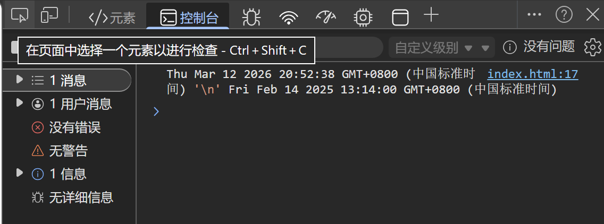
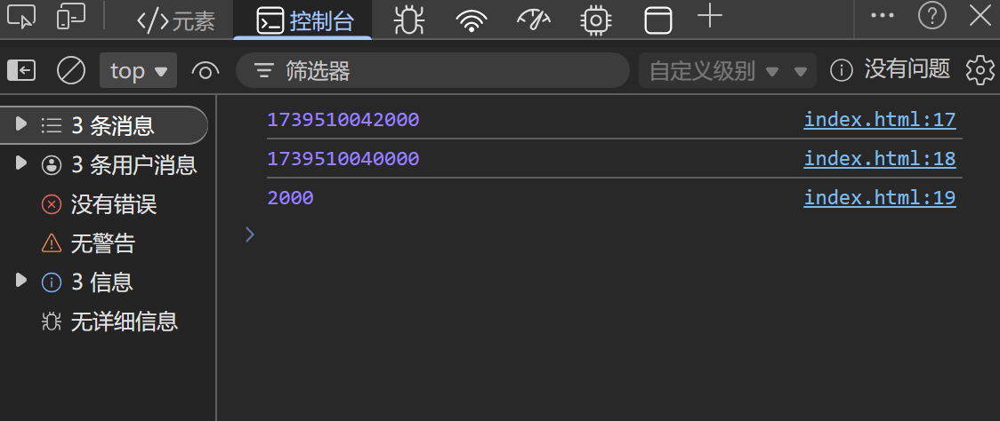

---
title: 日期对象
date: 2026-03-12
tags:
  - JavaScript
  - 日期
summary: JavaScript 日期对象的使用方法，包括获取日期、时间戳计算等常用操作。
cover: https://picsum.photos/seed/3.12/800/400
---

# 日期对象
### 代码示例
```javascript
const date = neww Date()
const date1 = new Date("2025-2-14 13:14:00")
console.log(date,date1)
```
### 运行效果

### 对象方法
|方法 | 作用 | 说明 |
| --- | --- | --- |
|getFullYear()|获得年份|获取四位年份|
|getMonth()|获得月份|取值为 0 ~ 11|
|getDate()|获取月份中的每一天|不同月份取值也不相同|
|getDay()|获取星期|取值为 0 ~ 6 (0对应Sunday)|
|getHours()|获取小时|取值为 0 ~ 23|
|getMinutes()|获取分钟|取值为 0 ~ 59|
|getSeconds()|获取秒|取值为 0 ~ 59|
## 时间戳
**指1970.1.1 0:00:00到某一时间点经历的毫秒数**
**两个时间点的时间戳作差即可得二者间的时间间隔**
### 代码示例
```javascript
<script>
    const date = +new Date("2025-2-14 13:14:02")
    const date1 = +new Date("2025-2-14 13:14:00")
    console.log(date)
    console.log(date1)
    console.log(date-date1)
</script>
```
### 运行效果

