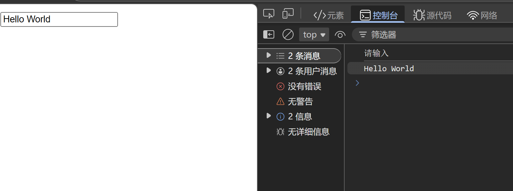
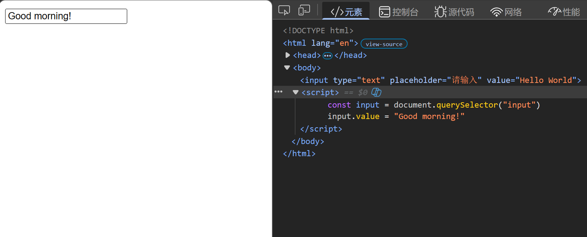
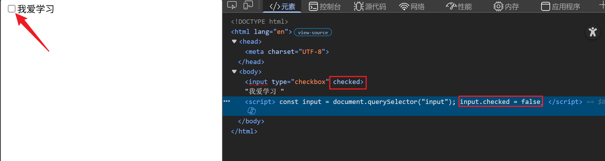

---
title: 操作表单元素
date: 2026-03-02
tags:
  - JavaScript
  - DOM
  - 表单
summary: JavaScript 操作表单元素的方法，包括获取和修改表单元素的值和属性。
cover: https://picsum.photos/seed/3.2/800/400
---

# 操作表单元素
## 格式
*表单对象.属性* = *值*
## 代码示例
```javascript
<input type="text" placeholder="请输入" value="Hello World">
<script>
    const input = document.querySelector("input")
    console.log(input.placeholder)
    console.log(input.value)
</script>
```
## 运行效果


#### 可以修改属性的值
```javascript
<input type="text" placeholder="请输入" value="Hello World">
<script>
    const input = document.querySelector("input")
    input.value = "Good morning!"
</script>
```
## 运行效果


#### 表单中的简写无值属性（disabled,checked,selected）在js中用boolean值表示，有就是true，没有就是false
```javascript
<input type="checkbox" checked>我爱学习
<script>
    const input = document.querySelector("input")
    input.checked = false
</script>
```


