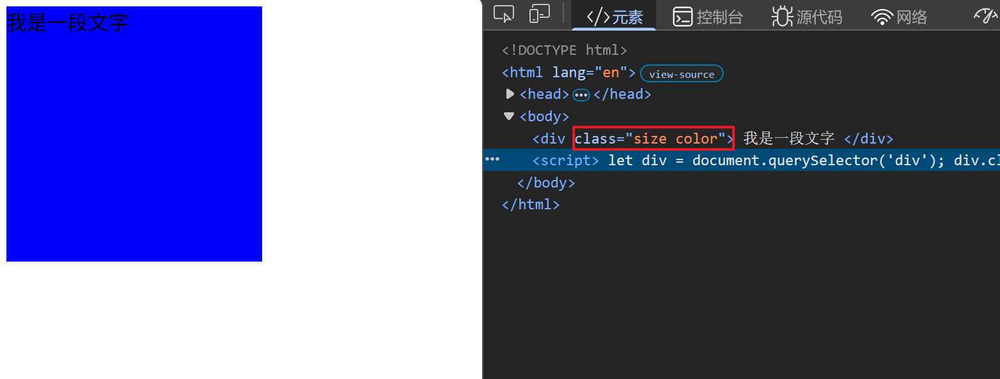
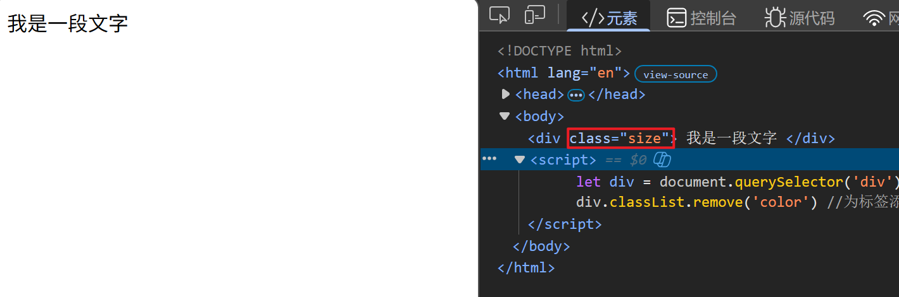

---
title: 通过classList配合CSS修改元素样式
date: 2026-03-02
tags:
  - JavaScript
  - DOM
  - CSS
summary: 使用classList API来添加、删除和切换元素的CSS类，实现动态样式修改。
cover: https://picsum.photos/seed/classlist/800/400
---

# 通过classList配合CSS修改元素样式
## 1. classList.add() 添加类
### 代码示例
```javascript
    <style>
        .size{
            width: 200px;
            height: 200px;
        }
        .color{
            background-color: blue;
        }
    </style>
```
```javascript
<div class="size">
    我是一段文字
</div>
<script>
    let div = document.querySelector('div');
    div.classList.add('color') //为标签添加类
</script>
```
### 运行效果

## 2. classList.remove() 删除类
### 代码示例
```javascript
<style>
    .size{
        width: 200px;
        height: 200px;
    }
    .color{
        background-color: blue;
    }
</style>
```
```javascript
<div class="size color">
    我是一段文字
</div>
<script>
    let div = document.querySelector('div');
    div.classList.remove('color') //删除标签的类
```
### 运行效果:

## 3. classList.toggle() 切换类
### 代码示例
```javascript
<style>
        .size{
            width: 200px;
            height: 200px;
        }
        .color{
            background-color: blue;
        }
</style>
```
```javascript
<div class="size">
    我是一段文字
</div>
<script>
    let div = document.querySelector('div');
    div.classList.toggle('color') //切换标签的类，已存在则删除，未存在则添加
</script>
```
