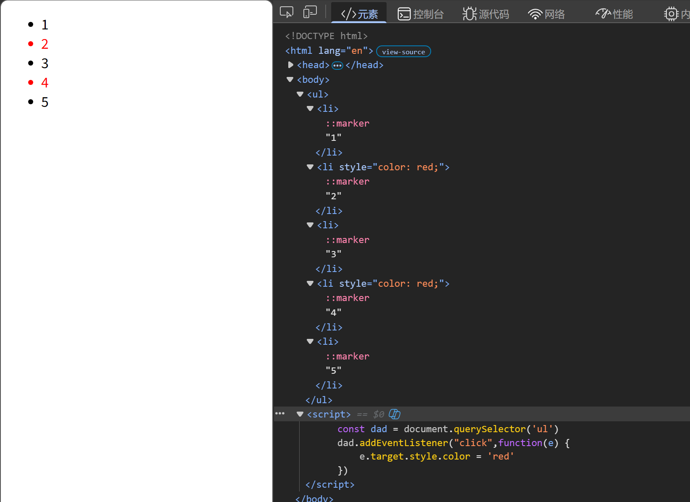

---
title: 事件监听
date: 2026-03-03
tags:
  - JavaScript
  - 事件
  - DOM
summary: JavaScript事件监听的使用方法，包括鼠标事件、键盘事件、焦点事件和表单事件。
cover: https://picsum.photos/seed/event/800/400
---

# 事件监听
### 格式
```javascript
元素对象.addEventListener(String 事件类型,function 执行函数)
```
- 鼠标事件
    |左键单击|**"click"**|
    |-|-|
    |左键双击|**"dbclick"**|
    |鼠标移入|**"mouseenter"**|
    |鼠标移出|**"mouseleave"**|
    |鼠标按下(左键，右键，中键)|**"mousedown"**|
    |鼠标松开|**"mouseup"**|
    |鼠标在元素内移动|**"mousemove"**|
    |鼠标右键按下|**"contextmenu"**|
- 键盘事件
    |键盘按下|**"keydown"**|
    |-|-|
    |键盘松开|**"kenup"**|
- 焦点事件
    |获得焦点|**"focus"** |
    |-|-|
    |失去焦点|**"blur"**|
- 表单事件
    |用户输入文本|**"input"**|
    |-|-|
### 代码示例
```javascript
<div>0</div>
<script>
    const div = document.querySelector('div')
    let a = 0
    div.addEventListener('mouseenter',function (){
        div.innerHTML = a
        a++
    })//每次鼠标经过div标签，其中数字都会增加1
</script>
```

### 移除事件监听
```javascript
监听对象.removeEventListener(String 事件类型,function 执行函数)
```
## :bug: 
**匿名函数无法移除**
## 事件委托
**原理：直接给父元素注册事件，通过冒泡原理使子元素触发**
**优点：减少addEventListener次数，提高性能**
### 代码示例
```javascript
<ul>
    <li>1</li>
    <li>2</li>
    <li>3</li>
    <li>4</li>
    <li>5</li>
</ul>
<script>
    const dad = document.querySelector('ul')
    dad.addEventListener("click",function(e) {
        e.target.style.color = 'red' //e.target对象特指触发事件的子元素对象，可使被点击的特定子元素变化
    })
</script>
```
### 运行效果

