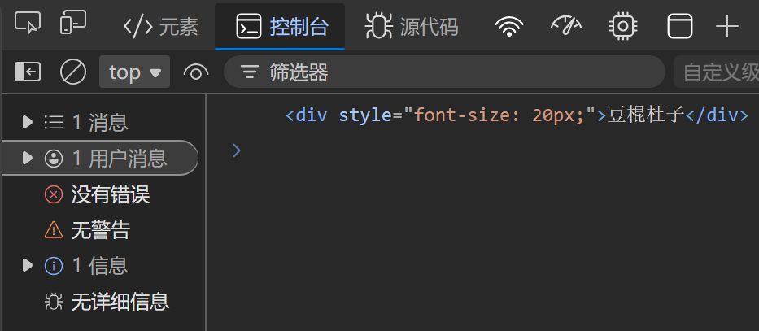
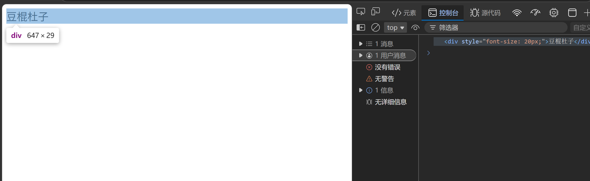
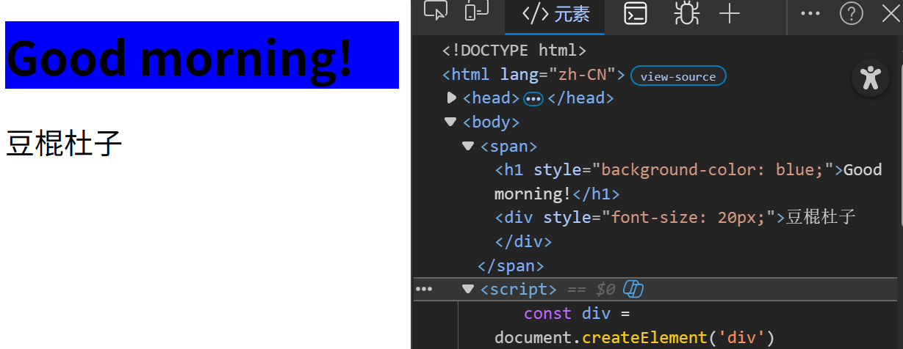

---
title: 新增节点
date: 2026-04-07
tags:
  - JavaScript
  - DOM
  - 节点
summary: JavaScript新增DOM节点的方法，包括createElement、appendChild和insertBefore的使用。
cover: https://picsum.photos/seed/append/800/400
---

# 新增节点
### 代码格式
先创建一个节点，后放入指定元素
##### 创建节点
```javascript
<script>
   const div = document.createElement('div')
   div.innerHTML = '豆棍杜子'
   div.style.fontSize = '20px'
   console.log(div)
</script>
```

##### 放入指定元素,appendChild()方法
```javascript
<span>
</span>
<script>
   const div = document.createElement('div')
   div.innerHTML = '豆棍杜子'
   div.style.fontSize = '20px'
   console.log(div)
   const span = document.querySelector('span')
   span.appendChild(div)
</script>
```


##### 放在某个指定元素前面,insertBefore()方法
```javascript
   const h1 = document.createElement('h1')
   h1.innerHTML = 'Good morning!'
   h1.style.backgroundColor = "blue"
   span.insertBefore(h1,div)
```

