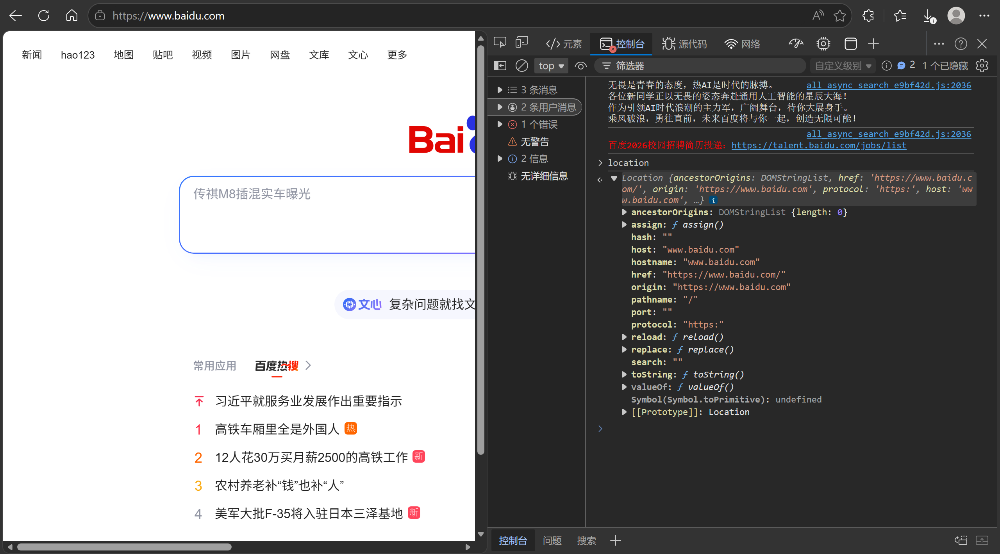

---
title: Location对象
date: 2026-04-08
tags:
  - JavaScript
  - BOM
  - Location
summary: JavaScript Location对象的使用方法，包括获取URL信息和页面跳转功能。
cover: https://picsum.photos/seed/location/800/400
---

# Location对象
`location`是一个**对象**,包含于`window`对象,它拆分并保存了url地址的各个部分

- `href`属性包含完整的url地址，对其重新赋值可用于跳转页面
- `search`属性包含地址中携带的参数,是url中符号`?`后面的部分
- `hash`属性包含地址的哈希值,是url中符号`#`后面的部分
- `location.reload(true)`方法直接刷新页面,参数`true`表示强制刷新
- `location.replace(url)`方法将当前页面替换为指定url地址页面,直接替换而不会留下浏览器历史记录

