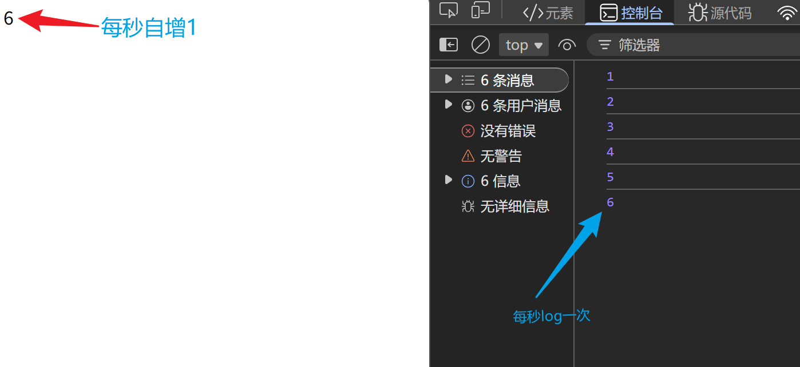
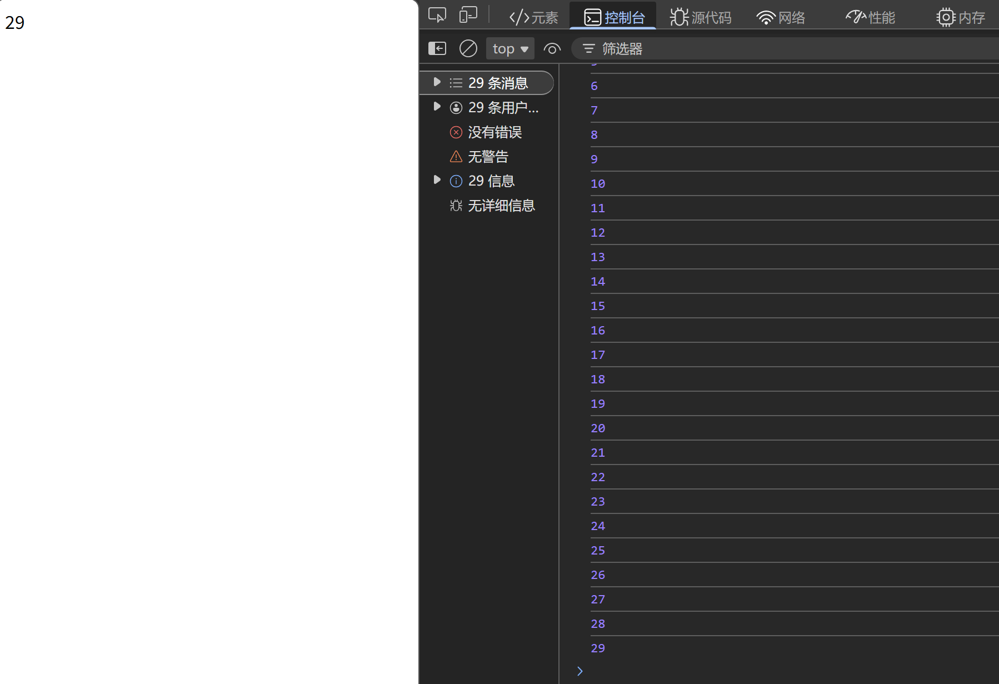

# 定时器-间歇函数
### 格式
```javascript
setInterval(function(){
    //函数体
},△t) //每△t ms执行一次函数体
//函数返回值是定时器对应id号,同一页面的定时器id使独一无二的
```
### 代码示例
```javascript
<div>999</div>
<script>
    const div = document.querySelector("div")
    let a = 0
    setInterval(function (){a++},1000)
    setInterval(function (){
        div.innerHTML = a 
    },1000)
    setInterval(function (){console.log(a)},1000)
</script>
```
### 运行效果


### :warning: *注意*
**setInterval函数的第一个参数若非匿名函数，只能写函数名，<u>不能加()</u>，加了()相当于调用了该函数，不再会循环执行该函数**

## 关闭定时器
```javascript
clearInterval(定时器id)
```
### 代码示例
```javascript
const div = document.querySelector("div")
let a = 0
let a_Id = setInterval(function (){
    a++
    if(a === 30){
        clearInterval(a_Id)
        clearInterval(b_Id)
        clearInterval(c_Id)
    } //a === 30时清除，innerHTML和log停留在29
},1000)
let b_Id = setInterval(function (){
    div.innerHTML = a
},1000)
let c_Id = setInterval(function (){
    console.log(a)
},1000)
```
### 运行效果

