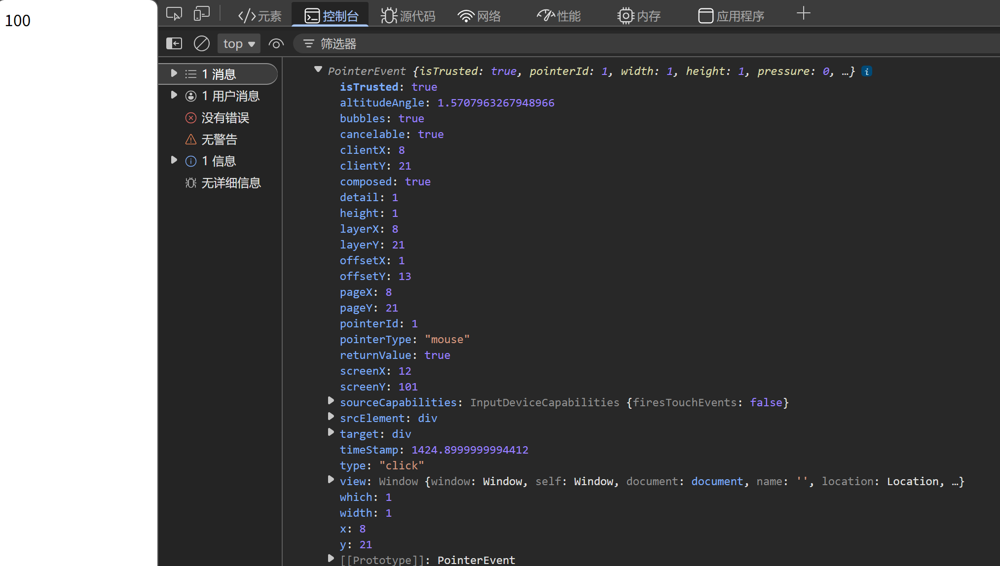

# 事件对象
**事件对象是一个对象，在事件监听绑定函数的第一个参数中触发，包含事件触发时的关键信息**
### 代码示例
```javascript
<div>100</div>
<script>
    const div = document.querySelector('div')
    div.addEventListener('click',(e)=>{
        console.log(e)
    })
</script>
```
### 运行效果

### 事件对象的常用属性
|属性|描述|
|-|-|
|type|事件类型|
|clientX/clientY|鼠标相对浏览器左上角的位置|
|offsetX/offsetY|鼠标相对当前DOM对象左上角的位置|
|key|用户按下的按键值|

