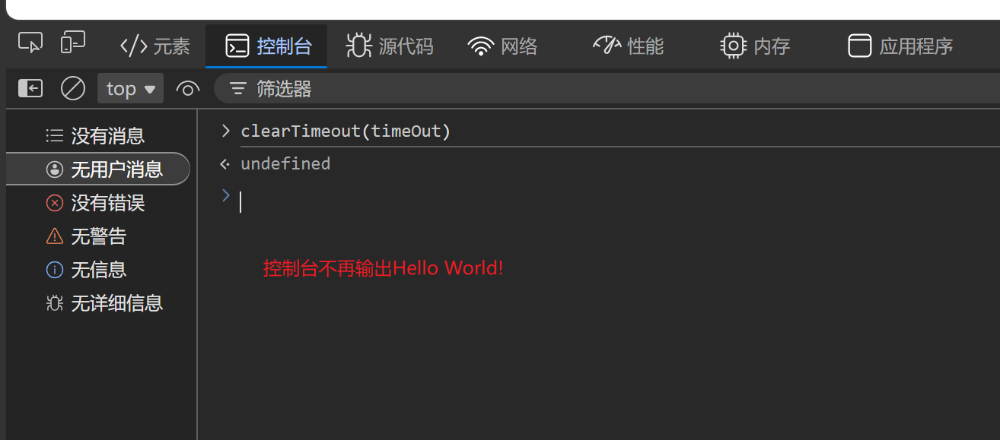

# 延迟函数
使事件延迟一定时间执行
```javascript
<script>
    let timeOut = setTimeout(()=>{
        console.log('Hello World!')
    },10000) //创建页面10s后在控制台输出Hello World！
</script>
```
类似setInterval(),setTimeout()返回一个id值,可作为清除延时函数的参数
```javascript
clearTimeout(timeOut)
```


