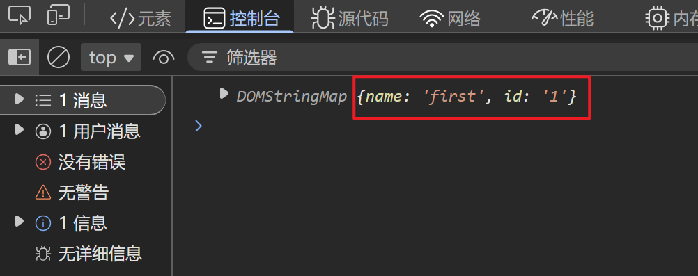

# h5自定义属性：data-*
### 代码示例
```javascript
<div data-name="first" data-id="1">one</div>
<script>
    const div = document.querySelector('div')
    console.log(div.dataset)
</script>
```
**元素对象的dataset属性包含所有<u>以data-为前缀</u>的自定义属性**

