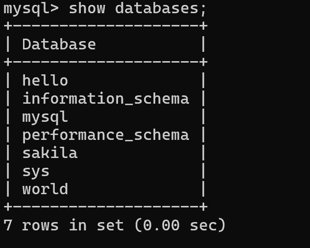
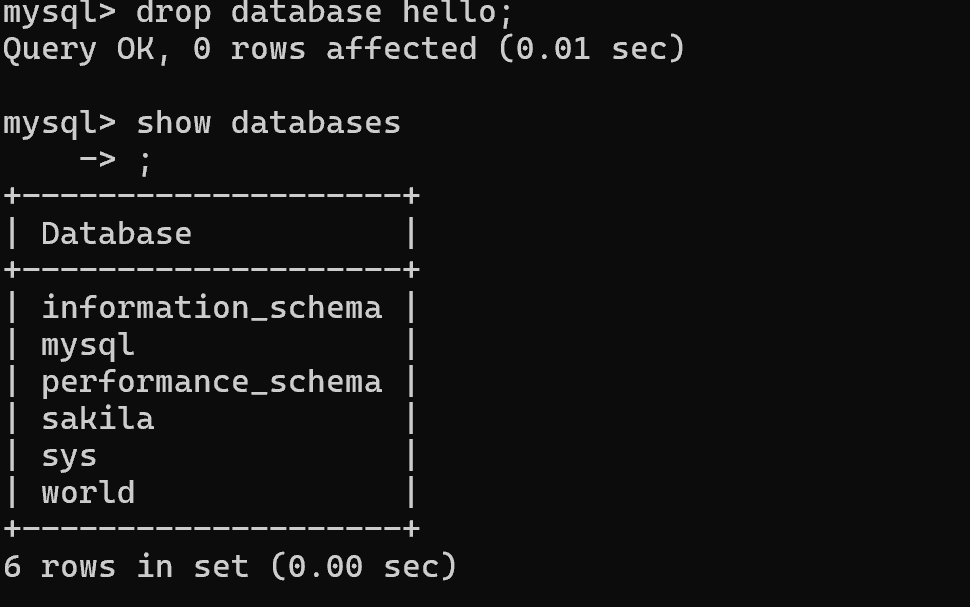
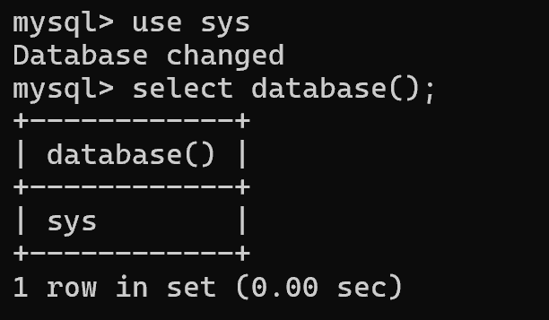
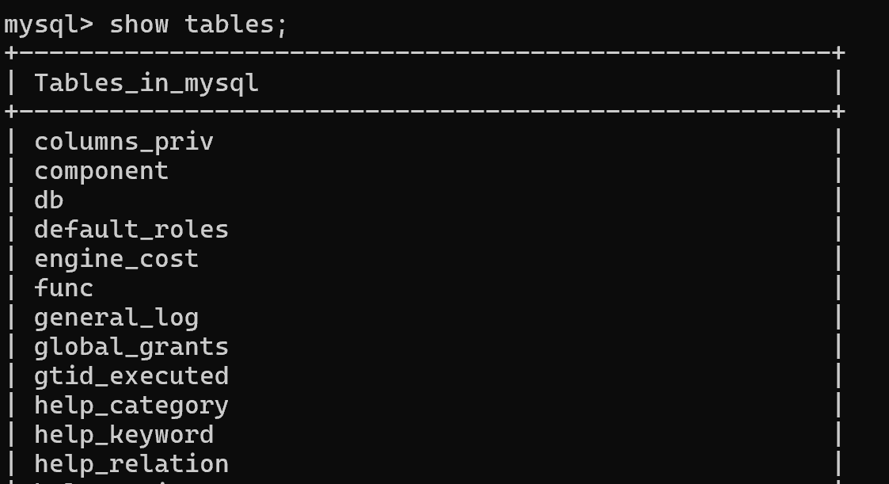
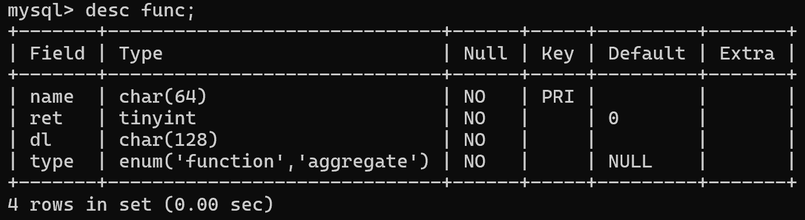
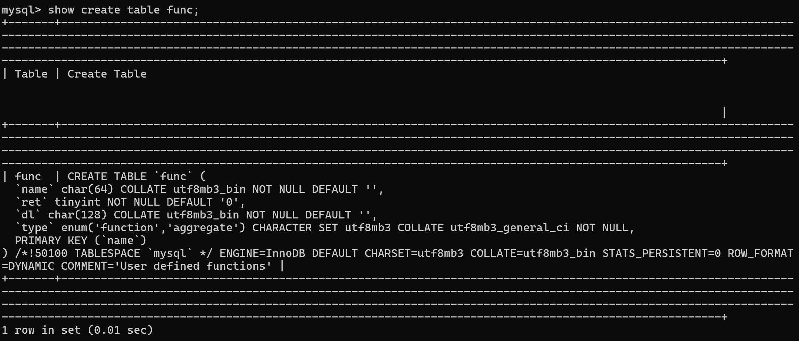
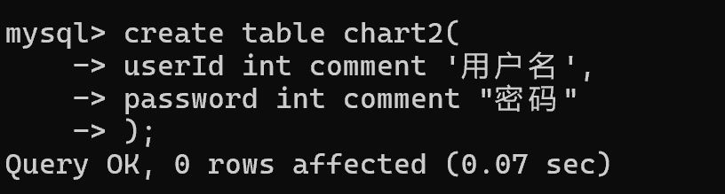
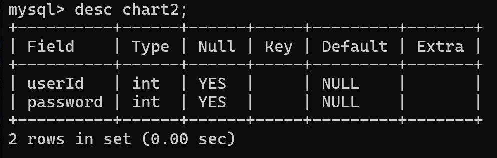

# MySQL

**SQL语句可以单行或多行书写，以`;`结束
MySQL语句大小写不敏感
以`--`或`#`作为单行注释开头,以`/* */`表示多行注释**

### SQL语句分类

| 分类  | 全称                         | 说明                          |
| --- | -------------------------- | --------------------------- |
| DDL | Data Definition Language   | 数据定义语言，用来定义数据库对象(数据库，表，字段)  |
| DML | Data Manipulation Language | 数据操作语言，用来对数据库表中的数据进行增删改     |
| DQL | Data Query Language        | 数据查询语言，用来查询数据库中表的记录         |
| DCL | Data Control Language      | 数据控制语言，用来创建数据库用户、控制数据库的访问权限 |

### DDL语句

```MySQL
show databases; --查询所有数据库

select database(); --查询当前数据库

create database [if not exists] 数据库名 [default charset 字
符集] [collat 排列规则]; --创建新数据库

drop database [if exists] 数据库名; --删除数据库

use 数据库名; --使用数据库

show tables; --查询当前数据库所有表

desc 表名; --查询表结构

show create table 表名; --查询指定表的建表语句

create table 表名(
   字段1 字段1类型 [comment 字段1注释],
    ......,
    字段n 字段n类型 [comment 字段n注释]
) [comment 表注释];  --新建表
```

### 示例

#### show databases



#### drop



#### use and select



#### show tables



#### desc



#### show create table



#### create table



