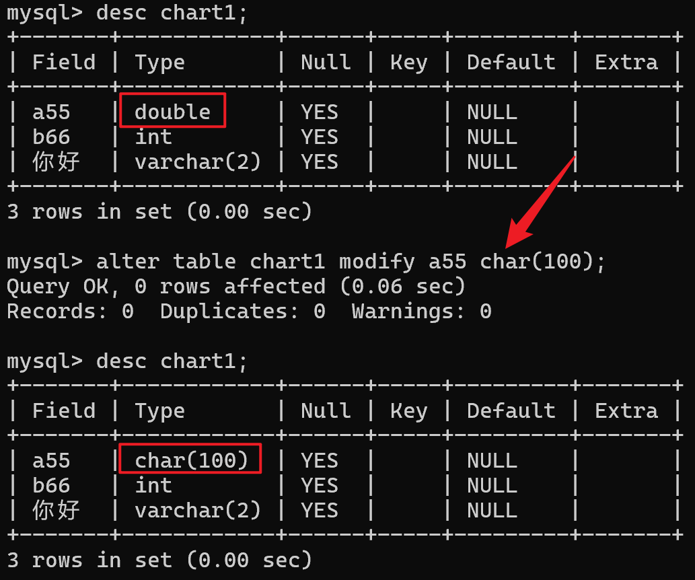
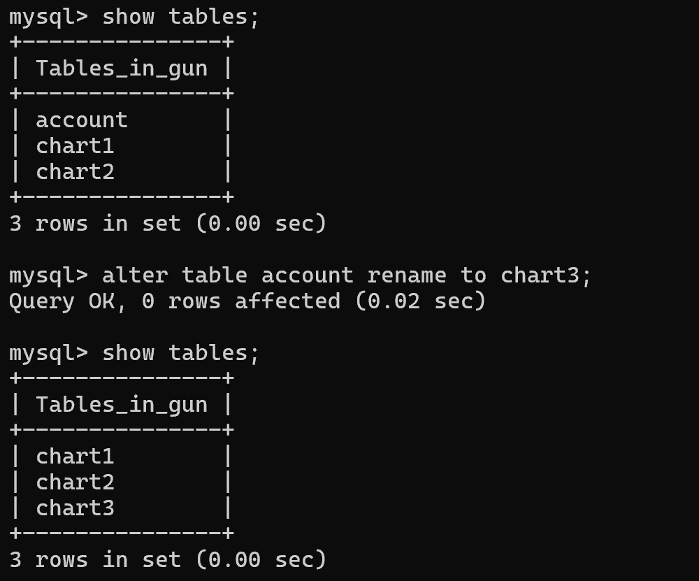

# DDL操作
### 语法格式
```SQL
alter 表名 add 字段名 数据类型(长度) [comment 注释] [约束]; --为表添加字段

alter table 表名 modify 字段名 新数据类型(长度); --修改字段的数据类型
alter table 表名 change 原字段名 新字段名 类型(长度) [comment 注释] [约束]; --修改字段名和数据类型

alter table 原表名 rename to 新表名 --修改表名

drop table [if exists] 表名; --删除表
truncate table 表名; --删除并重新创建表
```
### 运行效果


