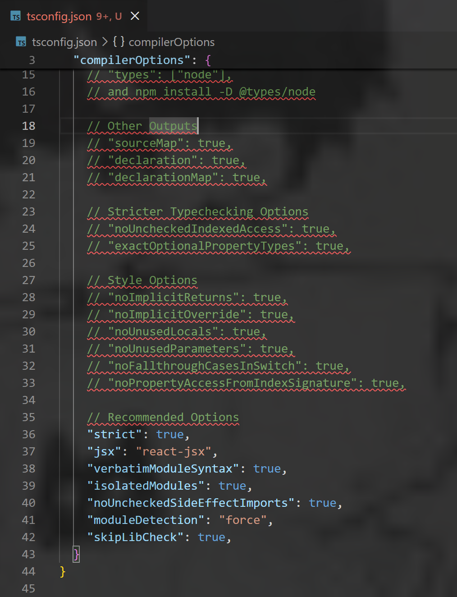
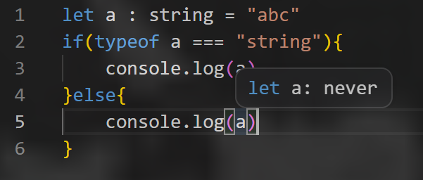

---

title: 初识TypeScript
date: 2026-04-24
tags:

- TypeScript
  summary: TypeScript是静态类型语言

---

# TypeScript

TypeScript是JavaScript的超集，下载TypeScript编译器:

```Shell
npm install i typescript -g
```

.ts文件编译成.js文件后运行:

```shell
tsc text.ts
```

初始化并生成配置文件tsconfig.json:

```shell
tsc --init
```

配置文件中包括编译规则、输出目录、语法版本、类型检查、包含/排除文件等



监听文件变化并自动编译:

```shell
tsc -w
#or
tsc --watch
```

ts是静态类型语言，变量类型不可变，ts基础类型包括`number` `string` `bigint` `null` `undifined` `boolean`在ts中定义变量需要声明类型,否则自动根据变量初始值推断类型,ts数据类型不能动态变化

```TypeScript
let a : string
let b = 99
b = 'hello' //报错
```

若定义变量时不声明类型也不赋值,变量会被推断为`any`类型,any类型的变量操作时不会进行类型检查,可以随意赋值,可以调用任意类型的特有方法,可以访问任意属性而不报错,同时可以被赋值给任意类型的变量,不建议将变量声明为any类型

```TypeScript
let x : any
x = 1
x = 'good' //不会报错
let y : number = x //不会报错
console.log(typeof y) //number
```

`unkonwn`是类型安全的any,声明为unkonwn型的变量也可以任意赋值,但不能被赋值给变量,不能调用任意类型的特有方法,不能访问任何一种属性
有两种办法将unknown类型的变量赋值给其他变量
```TypeScript
let a : unknown
a = 99
let b : number
```

- 类型检查
```TypeScript
if(typeof a === 'number'){
  b = a
}
```

- 断言
```TypeScript
b = a as number
//或
b = <number>a
```

`never`类型表示不能有任何值,一般不用于变量声明,由编译器自行断言

常用于限制函数,never型的函数式不仅不能return,而且不能正常结束(否则返回`undifined`),用在无限循环函数或:
```TypeScript
function err() : never{
  throw new Error("异常退出")
}
```