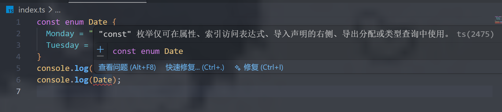

`object`类型能存储所有非基础类型数据,以下定义和调用全部合法:

```TypeScript
let a: object

a = {}
console.log(a)

a = [1, "2"]
console.log(a)

a = { name: "abc", age: 18 }
console.log(a)

a = () => {
  console.log("hello world")
}
(a as Function)() //a被认为是对象类型,需断言是函数后可调用
```

`Object`类型能存储几乎所有类型数据(除了null和undefined)

直接定义对象,并规定对象中元素的类型和数量:
```TypeScript
let a : {
  name : string
  age : number
  gender? : string //key后的'?'表示可选参数
  }

a = {'李华',18}

```

可以通过`索引签名`拓展对象定义方式:
```TypeScript
let a : {name:string
  age:number
  gender?:string
  [key:number]:string //[]内规定key的类型,[]外规定value的类型
}
a = {
  name:'李华',
  age:18,
  59:'100',
  0.5:'158' //可拓展任意数量符合类型的键值对
}
```

数组变量

```TypeScript
let a : Array<number>
//或
let b : string[]

a = [1,2,3]
b = ['a','b','c']
```

函数变量

```TypeScript
let add: (x: number, y: number) => number
add = (x: number, y: number): number => {
  return x + y
}
```

或简写为:

```TypeScript
add = (x, y) => {
  return x + y
}
```

元组(`tuple`)是一种特殊的数组,定义是可指定数组内元素的数量和类型:
```TypeScript
let a : [string,...number[],string] //...number[]表示任意数量的number
a = ['abc',1,2,3,1,3,'wasd']
```
定义元组时也支持用?表示可选对象,但需遵循以下规则:
- 可选元素不能跟在rest(即...string[]类)元素之后
- 必选元素不能位于可选元素之后

枚举(`enum`)用于定义一组命名常量,编译成js后本质是对象,数字枚举编译后会生成双向映射,若未赋初值则默认值为前一个元素的值+1得到,首个元素的默认值是0,若某元素的值与前面某元素相同,生成映射时前面元素的值会被覆盖
```TypeScript
enum Member {
  你 = 0,
  我 ,
  他 = 1,
} //{ '0': '你', '1': '他', '你': 0, '我': 1, '他': 1 }
//Member[1] === 他 , '我'被覆盖
```

字符串枚举不会自增和反向映射,所有对象必须都显示赋值

常量枚举编译后会直接变成内联常量,不生成js对象,类似`#DEFINE `
